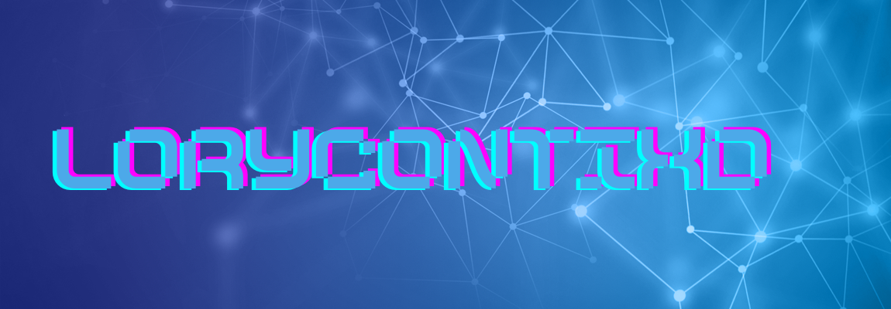

<h1 align="center">Hi 👋, I'm Lorenzo</h1>

-------------------
&emsp;
<h3 align="left">Hi 👋, I'm Lorenzo, a physics student who currently studies data science, but works on anything to do with computer science.</h3>
&emsp;

-------------------
&emsp;

- 📚 I’m currently finishing my studies for my university.
- 💡 I'm also expanding my knowledge with different languages and skills on the field.
- 💻 I’m currently learning **Quantum computing, GPU computing and cloud services**.
- 📱 I like web, app and game development.

- ⚽️ I love all kinds of sports, but I absolutely adore football and tennis.
- 🎼 I like to play the guitar and the piano (classical pieces).
- 🎬 Harry Potter & Star Wars fan.
- 🔭 I love astrophysics and observing the universe with my telescope.

&emsp;

## Me around the web:
-------------------

&emsp;

&emsp;

## 🛠️ My Skills
-------------------
### Programming languages:
&emsp;

### Misc tools:
&emsp;

### Databases:
&emsp;

### SRE & DevOps:
&emsp;

&emsp;

## 📈 My GitHub Stats and Activity

### 💻 Profile Stats

### 🔥 Streak Stats

### 📊 Contribution Stats

------
Credit: [Lorenzo Conti](https://github.com/lorycontixd)
Last Edited on: 25/07/2023